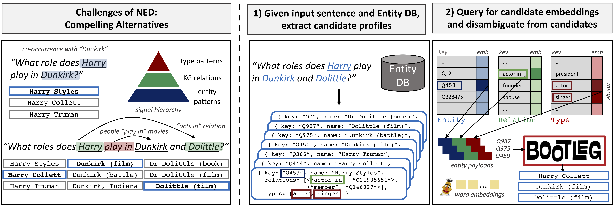

<p align="center">

</p>


[](https://codecov.io/gh/HazyResearch/bootleg)
[](https://bootleg.readthedocs.io/en/latest/?badge=latest)
[](https://opensource.org/licenses/Apache-2.0)

# Self-Supervision for Named Entity Disambiguation at the Tail
Bootleg is a self-supervised named entity disambiguation (NED) system for English built to improve disambiguation of entities that occur infrequently, or not at all, in training data. We call these entities *tail* entities. This is a critical task as the majority of entities are rare. The core insight behind Bootleg is that these tail entities can be disambiguated by reasoning over entity types and relations. We give an [overview](#bootleg-overview) of how Bootleg achieves this below. For details, please see our [blog post](https://hazyresearch.stanford.edu/bootleg_blog) and [paper](http://arxiv.org/abs/2010.10363).

Note that Bootleg is *actively under development* and feedback is welcome. Submit bugs on the Issues page or feel free to submit your contributions as a pull request.

**Update 9-25-2021**: We changed our architecture to be a biencoder. Our entity textual input still has all the goodness of types and KG relations, but our model now requires less storage space and has improved performance. A secret to getting the biencoder to work over the tail was heavy masking of the mention in the context encoder and entity title in the entity encoder.

**Update 2-15-2021**: We made a major rewrite of the codebase and moved to using Emmental for training--check out the [changelog](CHANGELOG.rst) for details)

# Getting Started

Install via

```
git clone git@github.com:HazyResearch/bootleg bootleg
cd bootleg
python3 setup.py install
```

Checkout out our installation and quickstart guide [here](https://bootleg.readthedocs.io/en/latest/gettingstarted/install.html).

### Models
Below is the link to download the English Bootleg model. The download comes with the saved model and config to run the model. We show in our [quickstart guide](https://bootleg.readthedocs.io/en/latest/gettingstarted/quickstart.html) and [end-to-end](tutorials/end2end_ned_tutorial.ipynb) tutorial how to load a config and run a model.

| Model               | Description                     | Number Parameters | Link     |
|-------------------  |---------------------------------|-------------------|----------|
| BootlegUncased      | Uses titles, descriptions, types, and KG relations. Trained on uncased data. | 110M | [Download](https://bootleg-data.s3-us-west-2.amazonaws.com/models/latest/bootleg_uncased.tar.gz) |

### Embeddings
Below is the link to download a dump of all entity embeddings from our entity encoder. Follow our entity profile tutorial [here](https://github.com/HazyResearch/bootleg/blob/master/tutorials/entity_profile_tutorial.ipynb) to load our EntityProfile. From there, you can use our ```get_eid``` [method](https://bootleg.readthedocs.io/en/latest/apidocs/bootleg.symbols.html#bootleg.symbols.entity_profile.EntityProfile.get_eid) to access the row id for an entity.

| Embeddings               | Description                     | Number Parameters | Link     |
|-------------------  |---------------------------------|-------------------|----------|
| 5.8M Wikipedia Entities      | Embeddings from BootlegUncased. | 1.2B | [Download](https://bootleg-data.s3-us-west-2.amazonaws.com/models/latest/bootleg_uncased_entity_embeddings.npy.tar.gz) |

### Metadata
Below is the link to download a dump of all entity metadata to use in our entity profile tutorial [here](https://github.com/HazyResearch/bootleg/blob/master/tutorials/entity_profile_tutorial.ipynb).

| Metadata               | Description                    | Link     |
|-------------------  |---------------------------------|----------|
| 5.8M Wikipedia Entities      | Wikidata metadata for entities. | [Download](https://bootleg-data.s3.us-west-2.amazonaws.com/data/latest/entity_db.tar.gz) |

## Tutorials
We provide tutorials to help users get familiar with Bootleg [here](tutorials/).

# Bootleg Overview
Given an input sentence, Bootleg takes the sentence and outputs a predicted entity for each detected mention. Bootleg first extracts mentions in the
sentence, and for each mention, we extract its set of possible candidate entities
and any structural information about that entity, e.g., type information or knowledge graph (KG) information. Bootleg leverages this information to generate an entity embedding through a Transformer entity encoder. The mention and its surrounding context is encoded in a context encoder. The entity with the highest dot product with the context is selected for each mention.



More details can be found [here](https://bootleg.readthedocs.io/en/latest/gettingstarted/input_data.html)

## Inference
Given a pretrained model, we support three types of inference: `--mode eval`, `--mode dump_preds`, and `--mode dump_embs`. `Eval` mode is the fastest option and will run the test files through the model and output aggregated quality metrics to the log. `Dump_preds` mode will write the individual predictions and corresponding probabilities to a jsonlines file. This is useful for error analysis. `Dump_embs` mode is the same as `dump_preds`, but will additionally output entity embeddings. These can then be read and processed in a downstream system. See this [notebook](tutorials/end2end_ned_tutorial.ipynb) to see how with a downloaded Bootleg model.

## Entity Embedding Extraction
As we have a separate encoder for generating an entity representation, we also support the ability to dump all entities to create a single entity embedding matrix for use downstream. This is done through the ```bootleg.extract_all_entities``` script. See this [notebook](tutorials/entity_embedding_tutorial.ipynb) to see how with a downloaded Bootleg model.

## Training
We recommend using GPUs for training Bootleg models. For large datasets, we support distributed training with Pytorch's Distributed DataParallel framework to distribute batches across multiple GPUs. Check out the [Basic Training](https://bootleg.readthedocs.io/en/latest/gettingstarted/training.html) and [Advanced Training](https://bootleg.readthedocs.io/en/latest/advanced/distributed_training.html) tutorials for more information and sample data!

## Downstream Tasks
Bootleg produces contextual entity embeddings (as well as learned static embeddings) that can be used in downstream tasks, such as relation extraction and question answering. Check out the [tutorial](tutorials) to see how this is done.

## Other Languages
The released Bootleg model only supports English, but we have trained multi-lingual models using Wikipedia and Wikidata. If you have interest in doing this, please let us know with an issue request or email lorr1@cs.stanford.edu. We have data prep code to help prepare multi-lingual data.
