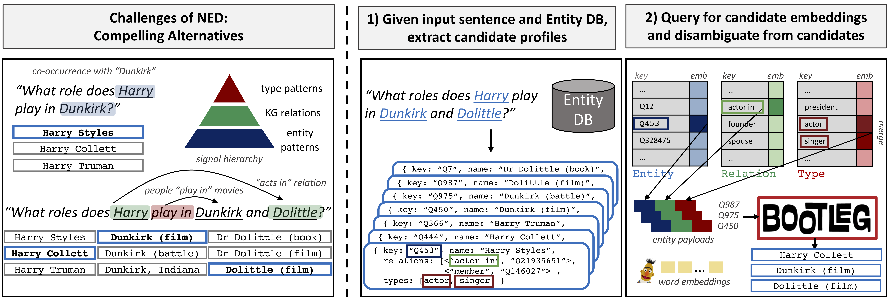

[](https://travis-ci.com/HazyResearch/bootleg)
[](https://opensource.org/licenses/Apache-2.0)

# Self-Supervision for Named Entity Disambiguation at the Tail
Bootleg is a self-supervised named entity disambiguation (NED) system built to improve disambiguation of entities that occur infrequently, or not at all, in training data. We call these entities *tail* entities. This is a critical task as the majority of entities are rare. The core insight behind Bootleg is that these tail entities can be disambiguated by reasoning over entity types and relations. We give an [overview](#bootleg-overview) of how Bootleg achieves this below. For details, please see our [paper](http://arxiv.org/abs/2010.10363).

Note that Bootleg is *actively under development* and feedback is welcome. Submit bugs on the Issues page or feel free to submit your contributions as a pull request.

# Getting Started

## Installation
Bootleg requires Python 3.6 or later. We recommend using `pip` or `conda` to install.

If using `pip`:

```
pip install -r requirements.txt
python setup.py develop
```

If using `conda`:

```
conda env create --name <env_name> --file conda_requirements.yml
python setup.py develop
```

Note that the requirements assume CUDA 10.2. To use CUDA 10.1, you will need to run:
```
pip install torch==1.5.0+cu101 torchvision==0.6.0+cu101 -f https://download.pytorch.org/whl/torch_stable.html
```

or

```
conda install pytorch==1.5.0 torchvision==0.6.0 cudatoolkit=10.1 -c pytorch
```
## Models
We have six different Bootleg models you can download. Each download comes with the saved model and config to run the model. We show in our [benchmark](tutorials/benchmark_tutorial.ipynb) tutorial and [end-to-end](tutorials/end2end_ned_tutorial.ipynb) tutorial how to load a config and run a model.

| Model             | Description                     | Number Parameters | Link     |
|-------------------|---------------------------------|-------------------|----------|
| Bootleg           | All entity embeddings with type and KG embeddings. Has an additional title embedding, sentence co-occurrence feature, and page co-occurrence feature. | 1.38B | [Download](https://bootleg-emb.s3.amazonaws.com/models/2020_10_22/bootleg_wiki.tar.gz) |
| BootlegMini       | Top 5 entity embeddings with type and KG embeddings. Has an additional title embedding, sentence co-occurrence feature, and page co-occurrence feature. | 84M | [Download](https://bootleg-emb.s3.amazonaws.com/models/2020_10_22/bootleg_wiki_mini.tar.gz) | 
| BootlegSimple     | All entity embeddings with type and KG embeddings.   | 1.37B | [Download](https://bootleg-emb.s3.amazonaws.com/models/2020_10_22/bootleg_wiki_simple.tar.gz) |
| BootlegSimpleMini | Top 5 entity embeddings with type and KG embeddings. | 82M   | [Download](https://bootleg-emb.s3.amazonaws.com/models/2020_10_22/bootleg_wiki_simple_mini.tar.gz) |
| BootlegType       | Type embeddings.                                     | 13M   | [Download](https://bootleg-emb.s3.amazonaws.com/models/2020_10_22/bootleg_types.tar.gz) |
| BootlegKG         | KG embeddings.                                       | 9M | [Download](https://bootleg-emb.s3.amazonaws.com/models/2020_10_22/bootleg_kg.tar.gz) |
    
## Tutorials
We provide tutorials to help users get familiar with Bootleg [here](tutorials/).

# Bootleg Overview
Given an input sentence, Bootleg takes the sentence and outputs a predicted entity for each detected mention. Bootleg first extracts mentions in the
sentence by querying our the mentions in a pre-mined candidate mapping (see [extract_mentions.py](bootleg/extract_mentions.py)). For each mention, we extract its set of possible candidate entities (done in [prep.py](bootleg/prep.py))
and any structural information about that entity, e.g., type information or knowledge graph (KG) information. The structural information is stored as embeddings in their
associated embedding classes. Bootleg leverages these embeddings as *entity payloads* along with the sentence information as *word embeddings* to predict which entity (possibly the NIL entity)
is associated with each mention.



## Entity Payload
We use three embeddings for the entity payloads. Each entity gets the following embeddings:
* Entity: learned embedding
* Type: learned embedding for each of its types
* Relation: learned embedding for each relation it participates in on Wikidata

We also allow the use of other entity-based features. In our benchmark model, we use a title embedding and a Wikipedia page co-occurrence statistical feature.

These embeddings are concatenated and projected to form an entity payload.

## Architecture
* Input: contextualized word embeddings (e.g. BERT) and entity payloads
* Network: uses [transformer](https://papers.nips.cc/paper/7181-attention-is-all-you-need.pdf) modules to learn patterns over phrases and entities
    * Phrase Module: attention over the sentence and entity payloads
    * Co-Occurrence Module: self-attention over the entity payloads
    * KG Module: takes the sum of the output of the phrase and co-occurrence modules and leverages KG connectivity among candidates as weights in an attention
* Score: uses MLP softmax layers to score each mention and candidate independently, selecting the most likely candidate per mention


<p align="center">
    
</p>

In the figure above, *M* represents the maximum number of mentions (or aliases) in the sentence, *K* represents the maximum number of candidates considered per mention, and *N* represents the maximum number of sub-words in the sentence. Typically, we use *M*=10, *K*=30, and *N*=100. Additionally, *H* is the hidden dimension used throughout the backbone, *E* is the dimension of the learned entity embedding, *R* the dimension of the learned relation embedding, and *T* the dimension of the learned type embedding. We further select an entity's 3 most popular types and 50 most unique Wikidata relations. These are all tunable parameters in Bootleg.

## Inference
Given a pretrained model, we support three types of inference: `--mode eval`, `--mode dump_preds`, and `--mode dump_embs`. `Eval` mode is the fastest option and will run the test files through the model and output aggregated quality metrics to the log. `Dump_preds` mode will write the individual predictions and corresponding probabilities to a jsonlines file. This is useful for error analysis. `Dump_embs` mode is the same as `dump_preds`, but will additionally  output contextual entity embeddings. These can then be read and processed in a downstream system.

## Training
We recommend using GPUs for training Bootleg models. For large datasets, we support distributed training with Pytorch's Distributed DataParallel framework to distribute batches across multiple GPUs. Check out the [Basic Training](tutorials/basic_training_tutorial.md) and [Advanced Training](tutorials/advanced_training_tutorial.md) tutorials for more information and sample data!

## Downstream Tasks
Bootleg produces contextual entity embeddings (as well as learned static embeddings) that can be used in downstream tasks, such as relation extraction and question answering. Check out the [tutorial](tutorials) to see how this is done.